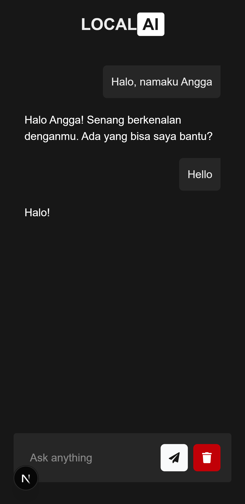
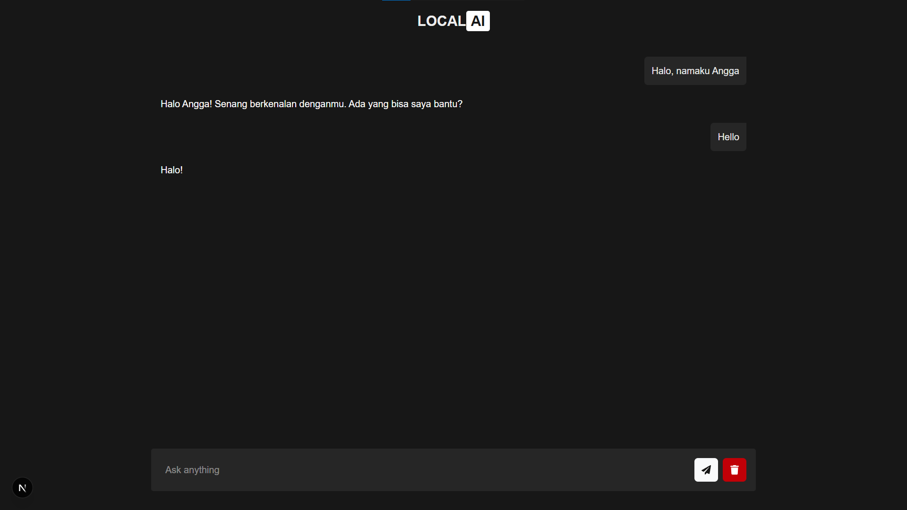

# 🤖 LocalAI

**LocalAI** is a web-based AI chat application inspired by ChatGPT and Gemini. It is built using **Next.js** and **Tailwind CSS**, and powered by the **Gemini API** from Google. This project also uses `localStorage` to persist conversation history on the client side.

---

## ✨ Features

- 🔹 Chat with an AI assistant using Google's Gemini API  
- 💾 Conversation history saved in `localStorage`  
- ⚡ Fast and responsive UI with Tailwind CSS  
- 🧠 Messages stored in a dynamic array for easy management  
- 🖥️ Built with modern web technologies using Next.js (React framework)  

---

## 🛠️ Tech Stack

- **Next.js** – React framework for SSR and performance  
- **Tailwind CSS** – Utility-first CSS for fast UI development  
- **Gemini API** – AI model from Google for conversational responses  
- **localStorage** – Save chat messages locally in the browser  

---

## 📦 Installation

Clone the repository and install dependencies:

```bash
git clone https://github.com/your-username/localai.git
ren "LocalAI" "local-ai"
cd local-ai
npm install
npm run dev
```

---

## 🌐 Environment Variables

Create a `.env.local` file in the root directory:

```
NEXT_PUBLIC_GEMINI_API_KEY=your_api_key_here
```

You can get your Gemini API key from https://makersuite.google.com/app/apikey

---

## 📸 Screenshots

> Mobile & Desktop View:

| Mobile View | Desktop View |
|-------------|--------------|
|  |  |

---

## 📁 Folder Structure

```
anflix/
├── app/              # Main chat page
├── .env.local        # Environment variables (paste your api key here)
└── ...
```

---

## 🔒 Notes & Limitations

- Gemini API requires an API key (free tier available)
- Currently no backend – all data is stored locally
- No login/authentication (privacy depends on browser)

---

## 📌 To-Do / Improvements

- ☁️ Add optional backend for saving chats
- 🌓 Implement dark mode toggle

---

## 🙌 Credits

- [Google Gemini API](http://ai.google.dev)
- [Next.js](https://nextjs.org/)
- [Tailwind CSS](https://tailwindcss.com/)
- Made with ❤️ by Angga
- ☕️ Like this project? Feel free to [buy me a coffee](https://lynk.id/payme/justangga)!

---

## 📄 License

This project is licensed under the MIT License.